# MCP Apps UI

gojira-mcp implements the [MCP Apps extension](https://modelcontextprotocol.io/extensions/apps)
(`io.modelcontextprotocol/ui`, SEP-1865 — Final since 2026-01-26): selected
tools link an HTML template via `_meta.ui.resourceUri`, the template is served
as a `ui://` resource with MIME `text/html;profile=mcp-app`, and UI-capable
hosts render it in a sandboxed iframe wired to the tool call. Hosts that don't
speak the extension ignore the metadata entirely — every tool result remains a
readable `{success, result|error}` JSON text block (now mirrored into
`structuredContent`).

Renders in: claude.ai web, Claude Desktop, Claude iOS/Android, ChatGPT
(developer mode / workspace connectors), VS Code Copilot, and other MCP Apps
hosts. Notably **not** Claude Code — CLI/IDE chat stays text-only.

## The five templates

| Template | Attached to | What it does |
|---|---|---|
| `ui://gojira/confirm-op.html` | **every destructive tool** (default; see below) | Renders the commit-positive dry-run as a diff card — RFC 6902 patch rows and/or before/after panes, target line, danger styling for permanent deletes — with a **Commit** button that re-invokes the same tool with the original arguments plus `commit: true`. Also renders committed results and error envelopes. |
| `ui://gojira/journal.html` | `gojira.readJournal` (ops `listRecentOperations`, `getOperation`) | Operation timeline with expandable detail (client-computed before/after patch) and a dry-run-first **Revert** flow for revertible entries. |
| `ui://gojira/aql-table.html` | `assets.aqlSearch` | Results table with dynamic attribute columns (from `objectTypeAttributes`), a column picker, per-page sort, and Prev/Next paging via re-invocation. |
| `ui://gojira/automation-rule.html` | `automation.readRule` (ops `listAutomationRules`, `getAutomationRule`) | Rule list (cursor paging) and trigger → conditions/branches → actions tree with raw value expanders. |
| `ui://gojira/request-build.html` | `jsm.inspectRequestBuild` | Readiness card, per-piece review table, canonical form/automation/portal/tracking links, and raw detail expanders. |

A template attaches to the whole collapsed tool, not to one op, so one view
renders every op it declares — the journal template handles both the list and
the single-entry shape, and `automation.readRule` likewise. Both are read-only
op tools; `assets.aqlSearch` stayed a single-op tool through the collapse.

## What they look like

Captured from the local render harness (`npm run ui:harness`) against fixture
data — see [Verifying locally](#verifying-locally).

### Confirm card (`ui://gojira/confirm-op.html`)

Dry-run with an RFC 6902 patch table; Commit re-invokes the tool with
`commit: true`:

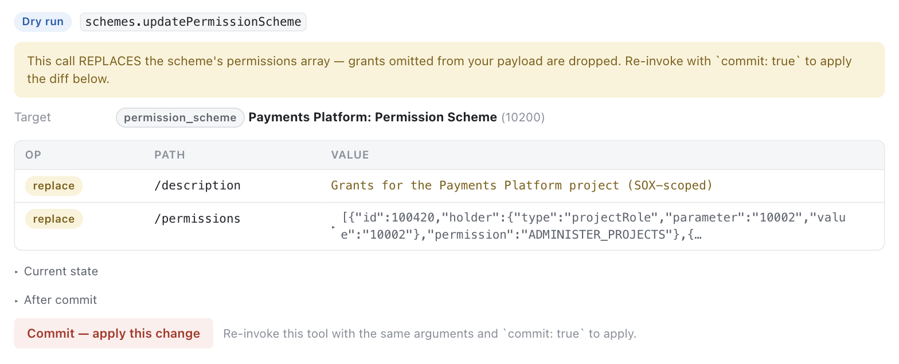

Delete-shaped dry-runs render the before-state and the mode. The message text
comes from the tool, so `projects.delete` distinguishes trash from
permanent:

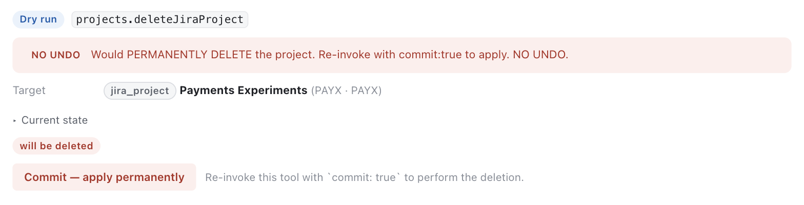

After committing, and on an error envelope:

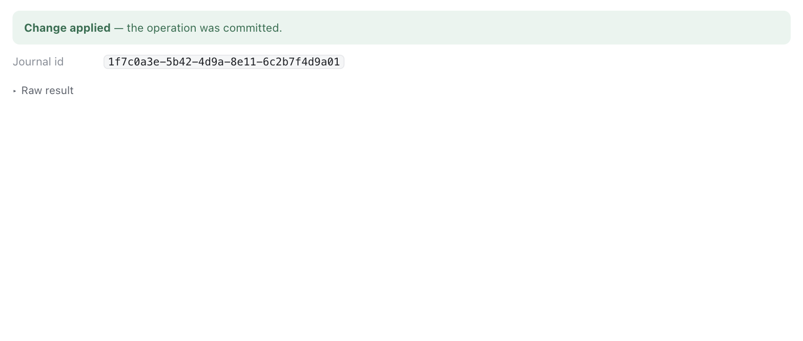

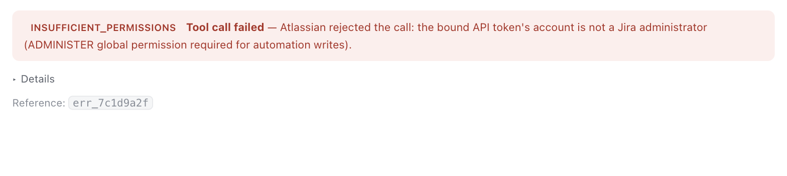

### Journal (`ui://gojira/journal.html`)

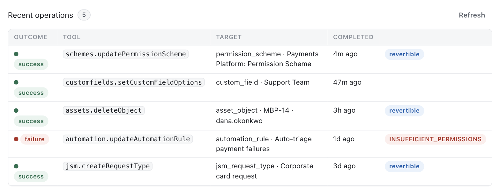

Row drill-in fetches the full entry via
`gojira.readJournal({ op: "getOperation", op_id })` and diffs before/after
locally with the same algorithm as `src/consent/jsonPatch.ts`:

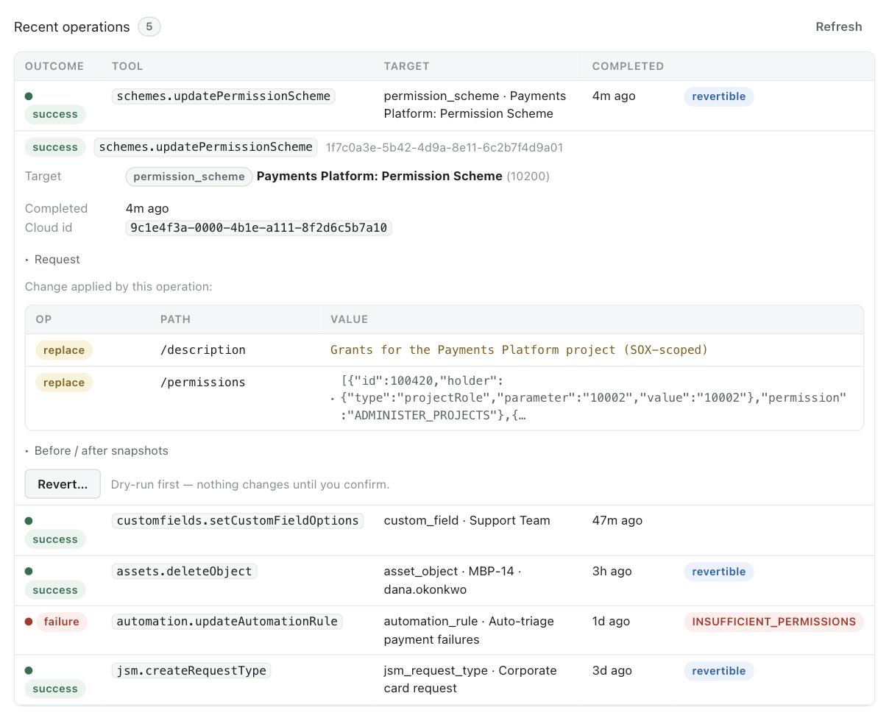

Revert previews the reverse patch before anything is applied:

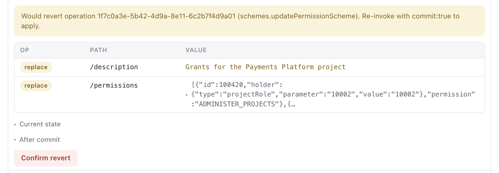

### Assets AQL table (`ui://gojira/aql-table.html`)

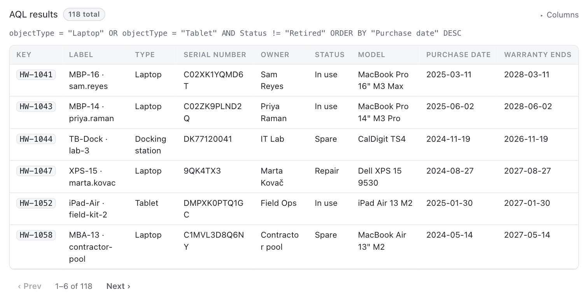

### Automation rules (`ui://gojira/automation-rule.html`)

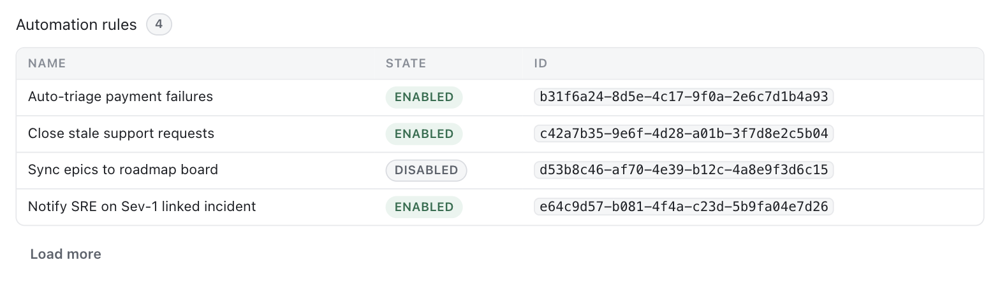

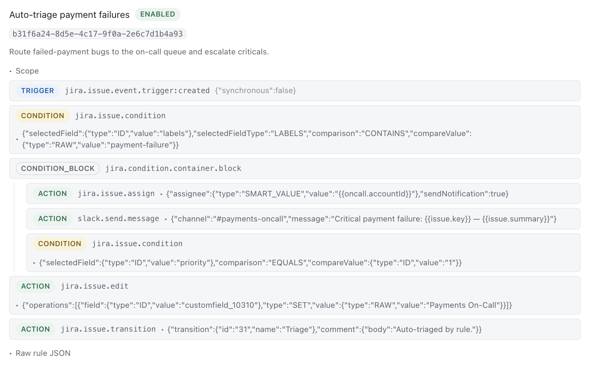

### Request build (`ui://gojira/request-build.html`)

Renders the inspector's configuration state and makes each associated piece
easy to open or expand. It keeps the live-verification warning visible even
when the build is `configured_unverified`.

### Theming

`data-theme` and the host's style variables come from the MCP Apps host
context; `color-scheme` is pinned to match so the UA canvas behind our
transparent body follows the host rather than the OS preference:

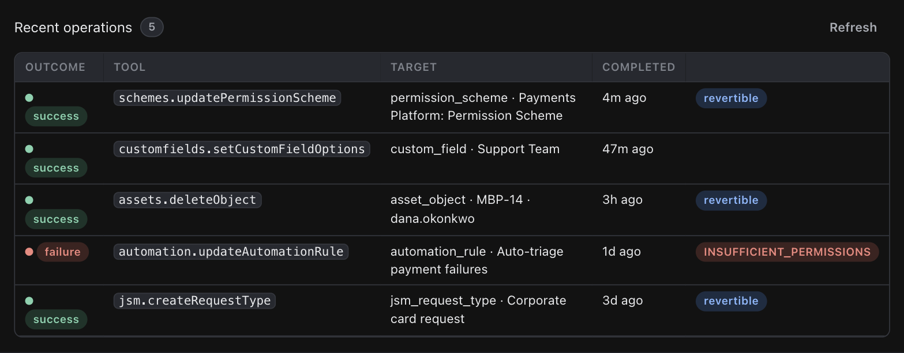

## How it's wired

- **Tool linkage** — `src/tools/wrapHandler.ts` adds, per tool:
  `outputSchema` (the loose `{success, result?, error?}` envelope),
  `structuredContent` on every result, truthful `annotations`
  (`destructiveHint` from `def.destructive`, `readOnlyHint` from an explicit
  `def.readOnly`, nothing otherwise — purely flag-driven, no name sniffing),
  and — when UI is active — `_meta.ui.resourceUri` plus the deprecated flat
  `ui/resourceUri` alias for older hosts.
- **Template selection** — `src/ui/appResources.ts#resolveUiResourceUri`:
  explicit `def.ui.resourceUri` wins; otherwise `destructive: true` defaults
  to the confirm card; otherwise no UI. Because the flag is per *tool*,
  `defineOpTool` refuses to build a tool that mixes destructive and read ops —
  otherwise the confirm card would attach to read results too.
- **Ops in view callbacks** — `op` is a required input on a collapsed tool, so
  a view calling back through `tools/call` must pass it explicitly. The
  journal view sends `{ op: "listRecentOperations", ... }` on refresh and
  `{ op: "getOperation", op_id }` on drill-in; the automation view sends
  `{ op: "getAutomationRule", ruleId }` and, when paging, spreads the original
  tool input so the inbound `op` rides along with the new `cursor`. Calls to
  single-op tools (`assets.aqlSearch`, `gojira.revertOperation`) carry no
  `op`.
- **Resource serving** — `registerUiResources` (called from
  `registerSessionTools`) registers only the templates actually referenced by
  the session's registered tools, so a deployment without `read_assets` never
  lists the AQL table.
- **Gating** — one switch: `GOJIRA_UI_ENABLED` (default on) **and** the
  presence of the built bundles in `ui/dist/`. Missing bundles log a single
  warning and the server runs text-only. `GOJIRA_UI_ASSETS_DIR` overrides the
  bundle directory (tests use this).

## The views

Browser sources live in `ui/src/` (TypeScript, no framework), built by
`scripts/build-ui.mjs` (esbuild) into self-contained single-file HTML in
`ui/dist/` — CSS and JS inlined, zero external requests, so the host's
deny-all CSP needs no exceptions. `npm run build` produces them; the Docker
image ships them.

Shared plumbing (`ui/src/shared/`):

- `host.ts` — bootstraps `@modelcontextprotocol/ext-apps`'s `App`
  (postMessage JSON-RPC bridge), applies host theme + MCP Apps style tokens
  (`--color-*`, `--font-*` … consumed with our palette as fallback), exposes
  `callTool` and a best-effort `updateModelContext` so the conversation model
  learns when a user commits or reverts from the view.
- `envelope.ts` — parses the gojira result envelope from
  `structuredContent` (fallback: first text block).
- `jsondiff.ts` — client-side port of `src/consent/jsonPatch.ts` so journal
  before/after pairs render the same diff the server produces at dry-run time.
- `dom.ts` / `render.ts` — DOM helpers (everything renders through
  `textContent`; upstream Atlassian data can never inject markup) and the
  shared patch-table / target / error / result renderers.

## Security posture

- Views are static HTML served from the MCP session itself; no external
  origins are declared in `_meta.ui.csp`, so hosts apply their default
  deny-all sandbox.
- The commit path goes through the normal tool pipeline — auth, rate limit,
  group allowlist, site pinning, journal, audit — because the view can only
  call `tools/call` back through the host; there is no side channel.
- `gojira.bindApiToken` deliberately has **no** UI: secret entry does not
  belong in a hosted iframe.

## Verifying locally

### The render harness (no tenant required)

`ui/harness/` is a minimal MCP Apps **host**: it loads a built template into a
sandboxed iframe and drives the real `AppBridge` postMessage bridge —
initialize handshake, host theme/style tokens, `tool-input` / `tool-result`
notifications, and fixture-backed answers to view-initiated `tools/call`. So
the interactive paths (commit, revert, paging, drill-in) all work with no
Atlassian tenant, no OAuth, and no Redis.

```bash
npm run build:ui     # templates → ui/dist
npm run ui:harness   # → http://localhost:5174/
```

Scenarios live in `ui/harness/fixtures.ts`; the index page lists them.
Each is addressable for screenshots:
`?scenario=<id>&theme=light|dark&chrome=off`.

Two things the harness taught us that are easy to get wrong, and are worth
preserving if you write another host: the bridge must be connected **before**
the iframe navigates (the view sends `ui/initialize` on load, and a host that
attaches late loses that request — the view then still receives notifications
and renders, but its handshake never completes), and a view whose body is
transparent needs `color-scheme` pinned to the host theme or the UA paints its
own light/dark canvas behind it.

### Against a real host

```bash
npm run build:ui && npm run dev
# then render the views with one of:
#  - the basic-host reference host from the modelcontextprotocol/ext-apps repo
#    (SERVERS='["http://localhost:8081/mcp"]' npm start)
#  - MCPJam / Postman (both render MCP Apps)
#  - claude.ai custom connector via an HTTPS tunnel to this server
```

The e2e rig (`npm run e2e`) exercises the dry-run→commit round trip the
confirm card drives; `tests/server/uiResources.test.ts` asserts the
tool-metadata and resource contract over a real in-memory MCP session.
